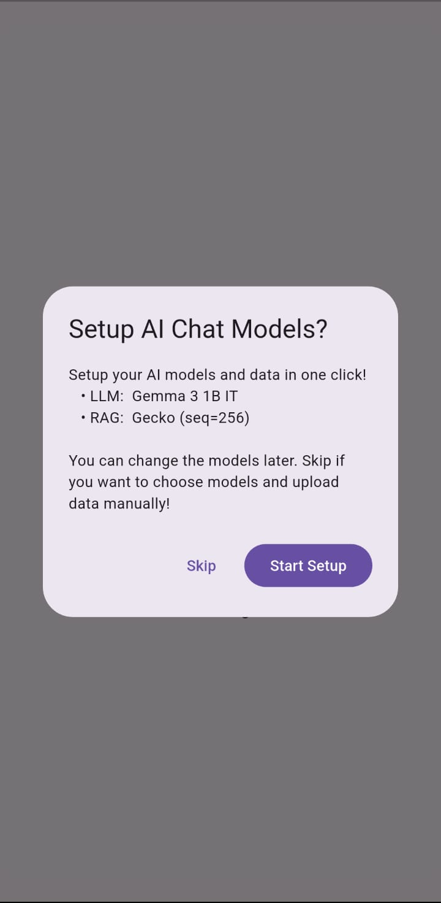
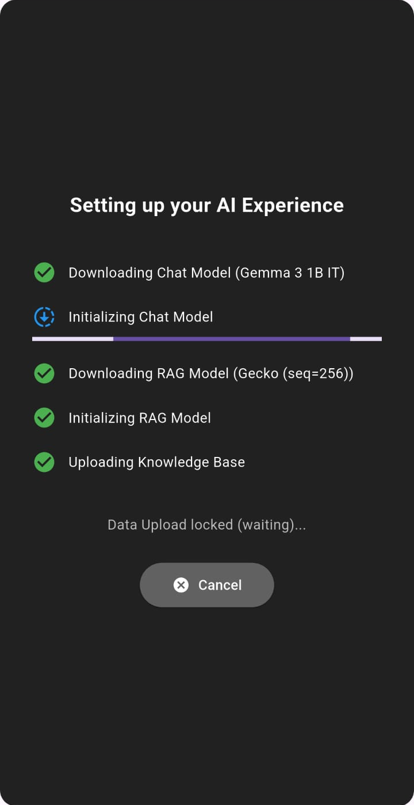
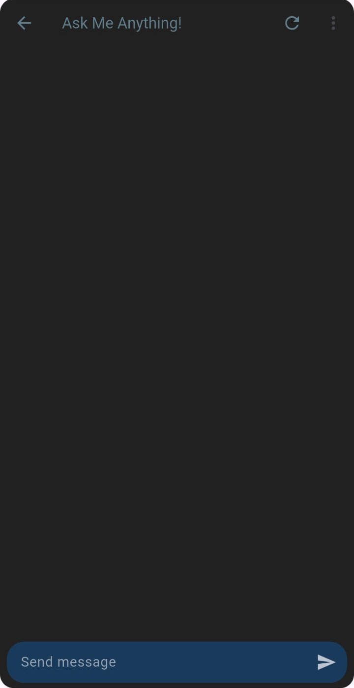
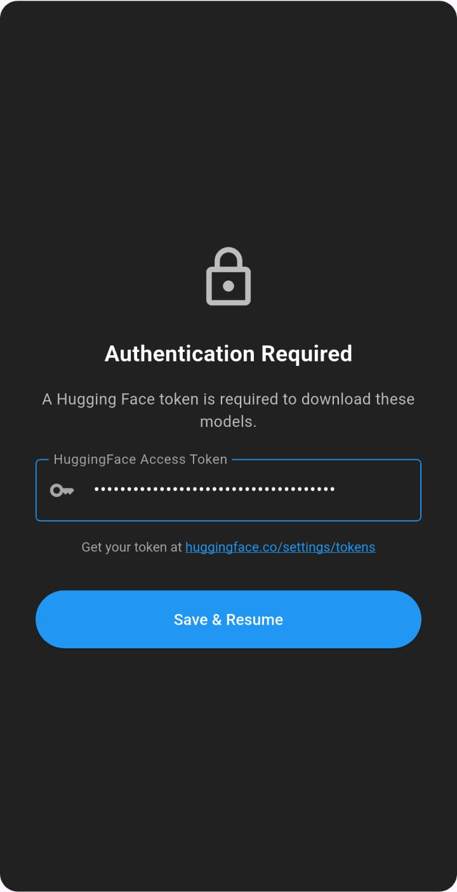
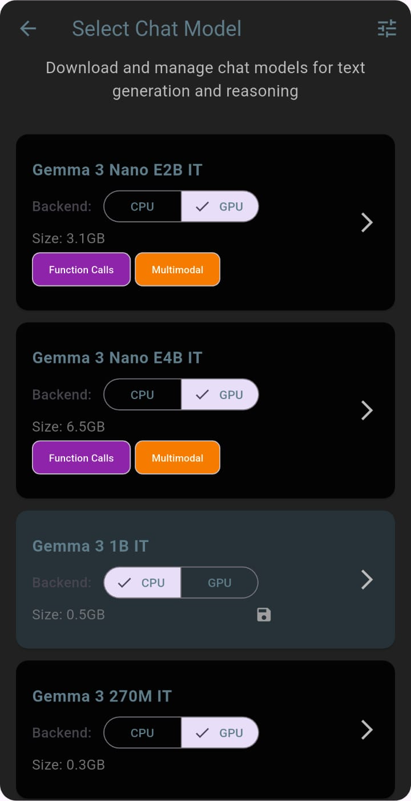
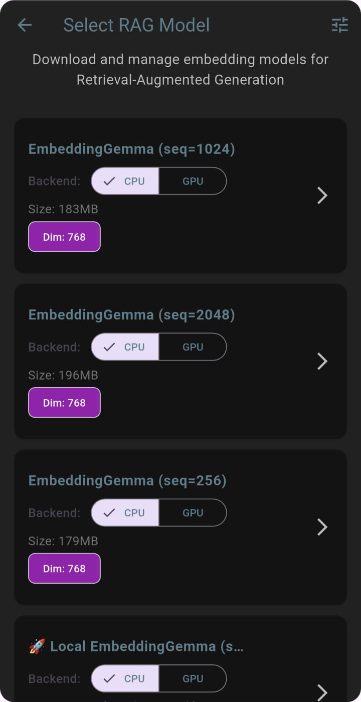
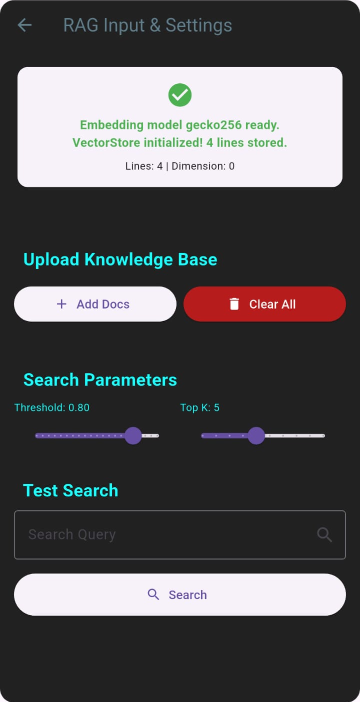
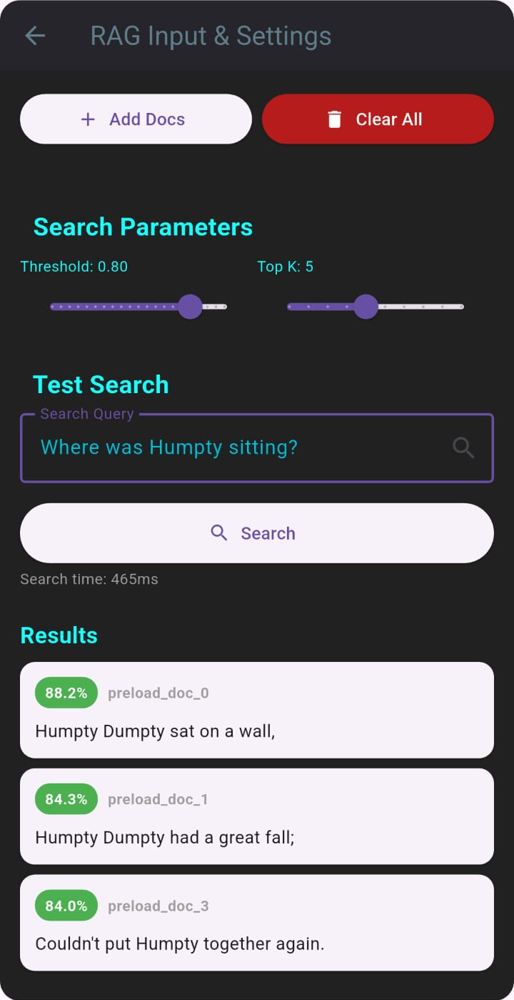

# onboard_llm_widget 🚀

**Local AI made effortless!**
* Turn the complex process - downloading local LLMs and RAG models and uploading Knowledge Base - into a single, beautiful, plug-and-play Flutter widget.

**Single-Click Preload & Orchestration**
* Provide your users with a smooth onboarding experience with a single click - handling hardware selection, model initialization, and data preloading - before seamlessly dropping them into a fully functional chat interface!

### Special Thanks!
A massive shoutout to [DenisovAV](https://github.com/DenisovAV) and the [flutter_gemma](https://github.com/DenisovAV/flutter_gemma) package. This widget was born by taking their brilliant example application and transforming it into a highly configurable, production-ready, and embeddable package. If you love local AI on Flutter, go star their repo!

## 📸 Screenshots

| One-Click Setup | &nbsp;&nbsp;&nbsp;&nbsp;&nbsp;&nbsp;&nbsp;&nbsp; | Seamless Orchestration |
| :---: | :---: | :---: |
|  | &nbsp; |  |

 

| Chat Interface | &nbsp;&nbsp;&nbsp;&nbsp;&nbsp;&nbsp;&nbsp;&nbsp; |                                    HuggingFace Auth                                     |
| :---: | :---: |:---------------------------------------------------------------------------------------:|
|  | &nbsp; |  |

 

| Select LLM Model | &nbsp;&nbsp;&nbsp;&nbsp;&nbsp;&nbsp;&nbsp;&nbsp; |                                    Select RAG Model                                     |
| :---: | :---: |:---------------------------------------------------------------------------------------:|
|  | &nbsp; |  |

 

| Upload Knowledge Base | &nbsp;&nbsp;&nbsp;&nbsp;&nbsp;&nbsp;&nbsp;&nbsp; | Perform RAG Search |
| :---: | :---: | :---: |
|  | &nbsp; |  |

## ✨ Features
* **Single-Click Preload & Orchestration:** Automatically orchestrate the downloading and initialization of LLM chat models, RAG embedding models, and the vectorization/upload of your custom Knowledge Base data—all executed flawlessly from a single user prompt.
* **Smart Caching:** Verifies model integrity (file size/existence) to prevent redundant downloads and save user bandwidth.
* **RAG Ready:** Built-in support for embedding models and preloading CSV/document data directly into a local vector store.
* **Hardware Acceleration:** Let users (or developers) force CPU or GPU backends for optimized inference.
* **Auto-Routing:** Skips the setup screen entirely if models and data are already cached and ready.
* **HuggingFace Auth:** Note that HuggingFace authentication may be needed to download certain licensed models.

## 🚀 Getting Started

Add the package to your `pubspec.yaml`:

    dependencies:
      onboard_llm_widget: ^0.0.8

## 💻 Usage

Just drop and customize the `LlmWidget` into your app's widget tree like below! It handles its own internal navigation, state management, and asynchronous initialization.

    import 'package:flutter/material.dart';
    import 'package:onboard_llm_widget/onboard_llm_widget.dart';

    class MyAiScreen extends StatelessWidget {
      @override
      Widget build(BuildContext context) {
        return Scaffold(
          body: LlmWidget(

            // 1. LLM Personality & Rules:
            appName: 'Jack - The Pirate Story Teller',
            preamble: 'You are a pirate named Jack who summarizes given CONTEXT and crafts a story out of it, but only speaks the old pirate tongue. You must answer USER_QUESTION within 100 words, using only CONTEXT unless it's EMPTY.',

            // 2. LLM and RAG model defaults:
            preloadModelsMandatory: 'ask',
            preloadModelBackend: 'cpu',
            preloadModelName: 'gemma3_1B',
            preloadEmbeddingModelBackend: 'cpu',
            preloadEmbeddingModelName: 'gecko256',
            bypassSelectionScreen: false,

            // 3. RAG Knowledge Base input defaults:
            preloadInputDataMandatory: 'yes',
            preloadInputData: 'Humpty Dumpty sat on a wall,\nHumpty Dumpty had a great fall;\nAll the king\'s horses and all the king\'s men\nCouldn\'t put Humpty together again.',
            enableRag: true,
            enableRagButton1: true,
            enableRagButton2: true,

          ),
        );
      }
    }

## ⚙️ Parameters

* **`appName`** *(String?)*:
  App title.

* **`backgroundColor`** *(Color?)*:
  Background color of the widget screens.

* **`chatAvatarImagePath`** *(String?)*:
  AI's avatar image path in the chat screen (eg: "assets/image1.png").

* **`preamble`** *(String?)*:
  System prompt injected before the last message to set the AI's behavior, rules and personality. Go ahead, ask it to talk like a pirate, matey!

* **`bypassSelectionScreen`** *(bool?)*:
  If `true`, skips the model selection UI entirely and jumps to chat (requires LLM and/or RAG models to be preloaded). Can be bypassed to hide complexity from end-user.

* **`enableRag`** *(bool?)*:
  Master switch to enable Retrieval-Augmented Generation capabilities. This enables RAG search whenever LLM is prompted, and the search output will be appended back to final LLM prompt, under 'CONTEXT' section!

* **`enableRagButton1`** *(bool?)*:
  Toggles visibility of the "Select RAG Model" button in the UI dropdown. Can be disabled to hide complexity from end-user, if model is preloaded.

* **`enableRagButton2`** *(bool?)*:
  Toggles visibility of the "RAG Input & Settings" button in the UI dropdown. Can be disabled to hide complexity from end-user, if knowledge base is preloaded.

* **`preloadModelsMandatory`** *(String?)*:
  Accepts `'yes'`, `'no'`, or `'ask'`. Customize if the user is free to download any models, or prompted/mandated to download specific models.

* **`preloadModelName`** *(String?)*:
  The exact identifier of the default chat model to fetch for LLM chat. See reference model names here: https://github.com/DenisovAV/flutter_gemma/blob/96b881f9ffde6f5783b4ded36c40913fefa0c935/example/lib/models/model.dart

* **`preloadModelBackend`** *(String?)*:
  Forces the chat model to run on `'cpu'` or `'gpu'`.

* **`preloadEmbeddingModelName`** *(String?)*:
  The exact identifier of the default embedding model to fetch for RAG tasks.  See reference model names here: https://github.com/DenisovAV/flutter_gemma/blob/96b881f9ffde6f5783b4ded36c40913fefa0c935/example/lib/models/embedding_model.dart

* **`preloadEmbeddingModelBackend`** *(String?)*:
  Forces the embedding model to run on `'cpu'` or `'gpu'`.

* **`preloadInputData`** *(String?)*:
  The raw string data to vectorize and preload (e.g., CSV content in plain conversational text). Individual lines are uploaded independently in the Knowledge Base.

* **`preloadInputDataMandatory`** *(String?)*:
  Accepts `'yes'`, `'no'`, or `'ask'`. Customize if the user is mandated to vectorize the input data, or try uploading custom files manually.

## ⚠️ Current Limitations (Still Experimental)
Please keep in mind that on-device AI is still an evolving field, and this widget is currently **experimental**:
* **Hardware Constraints:** The widget's performance and stability are heavily limited by the host device's hardware capabilities (RAM, CPU, and GPU).
* **RAG Capacity:** The Retrieval-Augmented Generation (RAG) feature is currently limited to processing a maximum of **100 lines** of input data.
* **Short-term Memory:** Local models have a strictly limited maximum context window, meaning very long-term memory or massive chat histories are not available right now.

*We are hopeful that as local models and mobile hardware continue to optimize, these limitations will improve in the near future!*